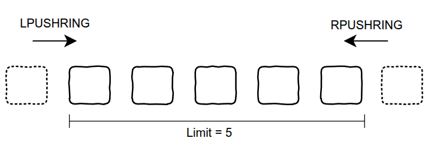
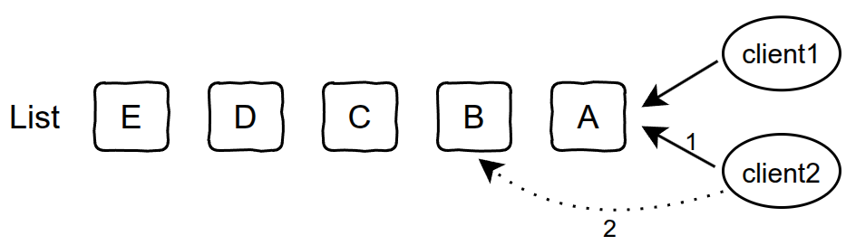

# 🚀 Redis Atomic Module

Redis Atomic Module 提供了一组原子性更强、语义更丰富的集合和列表操作命令，适用于分布式场景下的并发控制、队列消费、容量限制等需求。

## 📦 安装

1. 编译模块并加载到 Redis：
   ```bash
   redis-server --loadmodule /path/to/atomic-module.so
   ```
2. 或在 redis-cli 运行：
   ```bash
   MODULE LOAD /path/to/atomic-module.so
   ```

---

## 📝 命令列表与说明

### 1️⃣ HCAS —— Hash 字段原子比较并设置

- **语法**：`HCAS key field expected_value new_value`
- **参数**：
  - `key`：Hash 键名
  - `field`：字段名
  - `expected_value`：期望的旧值
  - `new_value`：要设置的新值
- **返回值**：
  - `-1`：字段不存在
  - `1`：更新成功（旧值等于期望值）
  - `0`：更新失败（旧值不等于期望值）
- **场景**：
  - 分布式锁、乐观并发控制、状态机原子迁移

---

### 2️⃣ HCAD —— Hash 字段原子比较并删除

- **语法**：`HCAD key field expected_value`
- **参数**：
  - `key`：Hash 键名
  - `field`：字段名
  - `expected_value`：期望的旧值
- **返回值**：
  - `-1`：字段不存在
  - `1`：删除成功（旧值等于期望值）
  - `0`：删除失败（旧值不等于期望值）
- **场景**：
  - 分布式锁的安全解锁（防止被误解锁）

---

### 3️⃣ LPUSHRING / RPUSHRING —— 环形队列（自动裁剪）

- **语法**：
  - `LPUSHRING key len value`
  - `RPUSHRING key len value`
- **参数**：
  - `key`：List 键名
  - `len`：最大长度（正整数）
  - `value`：要插入的元素
- **返回值**：
  - 队列未满：返回插入后队列长度
  - 队列已满：返回被裁剪出的元素列表
- **场景**：
  - 固定容量队列、滑动窗口、LRU缓存
  - 保存同一用户的最新最近n条数据




---

### 4️⃣ LPUSHNF / RPUSHNF —— 非满队列安全插入

- **语法**：
  - `LPUSHNF key len value [value ...]`
  - `RPUSHNF key len value [value ...]`
- **参数**：
  - `key`：List 键名
  - `len`：最大长度（正整数）
  - `value`：要插入的元素
- **返回值**：
  - 插入成功：返回插入后队列长度
  - 队列已满或容量不足所需元素：返回负数, 绝对值代表完成本次插入共需多少容量
- **场景**：
  - 固定容量队列、流量控制、限流队列
  - 信号量

---

### 5️⃣ LPOPIF / RPOPIF —— 条件安全的消费队列

- **语法**：
  - `LPOPIF key [eq/ne] value`
  - `RPOPIF key [eq/ne] value`

- **参数**：
  - `key`：List 键名
  - `eq/ne`: 比较操作符
  - `value`：待匹配的队头/队尾元素值

- **返回值**：
  - 匹配：弹出并返回元素
  - 不匹配：返回 `0`
  - 队列为空：返回 `nil`

- **场景**：
  - 精确一次消费、幂等队列




---

### 6️⃣ ZPOPMAXIF / ZPOPMINIF —— 当score满足条件时安全消费

- **语法**：
  
  - `ZPOPMAXIF key [gt/lt/gte/lte/eq/ne] score`
  - `ZPOPMINIF key [gt/lt/gte/lte/eq/ne] score`
  
- **参数**：
  
  - `key`：List 键名
  - `gt/lt/gte/lte/eq/ne`: 比较操作符
  - `score`：待匹配的score
  
- **返回值**：
  
  - 匹配：返回对应元素和score的数组
  - 不匹配：返回 `0`
  - 队列为空：返回空数组
  
- **场景**：
  
  - **公平的分布式锁** 
  
    作为等待队列，实例抢锁时将时间戳作为score写入zset，在实例异常宕机后，其他客户端可以判断队头实例是否超时，超时后删除其元素，防止锁一直被占用
  
    若无该原子命令，在并发场景下，会出现多个客户端peek队头元素判断满足出队条件，然后同时执行pop，误将多个元素删除
---

### 7️⃣ HSETEX / LPUSHEX / RPUSHEX —— 带过期的集合/列表操作

- **语法**：
  - `HSETEX key field value [field value ...] [EX/EXAT/PX/PXAT] time`
  - `LPUSHEX key value [value ...] [EX/EXAT/PX/PXAT] time`
  - `RPUSHEX key value [value ...] [EX/EXAT/PX/PXAT] time`
  - `SADDEX key value [value ...] [EX/EXAT/PX/PXAT] time`
- **参数**：
  - `key`：键名
  - `value`：要插入的元素
  - `EX seconds`: 设置指定的过期时间，以秒为单位
  - `PX milliseconds`: 设置指定的过期时间，以毫秒为单位
  - `EXAT timestamp-seconds`: 设置指定的Unix时间, 以秒为单位, 表示键将在此时间点过期
  - `PXAT timestamp-milliseconds`: 设置指定的Unix时间, 以毫秒为单位, 表示键将在此时间点过期
- **返回值**：
  - 与不带过期时间的相应命令保持相同。如：`HSETEX`语义与`HSET`相同,  `LPUSHEX`语义与`LPUSH`相同
- **场景**：
  - 用于带过期时间的集合/队列写入, 避免异常场景下漏设过期时间
  - 无KEEPTTL参数, hset会保持ttl, hsetex每次必须带ttl更新

---

## 📒场景类型

| 类型                | 相关命令                                                 | 说明                                                         | 场景                   |
| ------------------- | -------------------------------------------------------- | ------------------------------------------------------------ | ---------------------- |
| 先比较再操作        | HCAS、HCAD<br />LPOPIF、RPOPIF<br />ZPOPMAXIF、ZPOPMINIF | 1. 将string类型的CAS和CAD引入hash类型<br />2. 提供精确一次的消费语义，防止多个客户端判断在队头元素满足条件时同时执行POP | 幂等消费、分布式公平锁 |
| List相关的容量控制  | LPUSHRING、RPUSHRING<br />LPUSHNF、RPUSHNF               | 原生redis的list操作都不带长度容量信息，list为无限队列，容易形成大value | 滑动窗口、限流、信号量 |
| 集合类型 + 过期时间 | HSETEX、LPUSHEX、RPUSHEX、SADDEX                         | 等同string类型的setex命令                                    |                        |


----

## ⚠️ 错误信息

- 过期时间必须为正整数：返回 `ERR invalid expire time, must be a positive integer`
- 无效的比较操作符 (POPIF)：返回 `ERR invalid comparison flag`

---

## 🧪 单元测试

详见 `tests/atomic.tcl`，覆盖所有命令的基本功能、边界场景和错误处理。

---

## 🛠️ 贡献与反馈

欢迎提交 Issue 或 PR，完善更多原子操作和过期语义！
